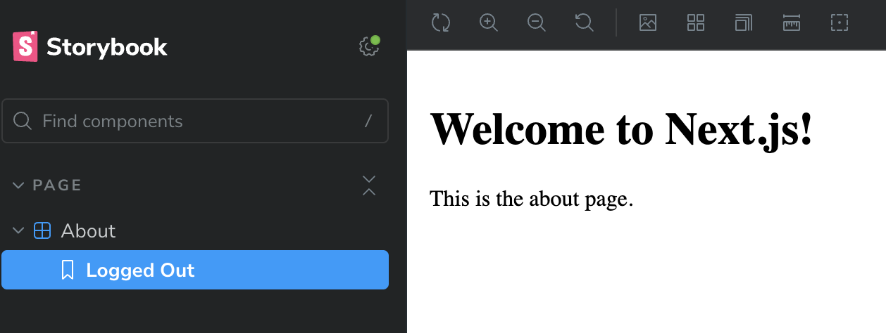

<h1>Next.js Latest (Webpack | JavaScript)</h1>

[](https://stackblitz.com/github/chris-erickson/next-js-scss-modules-repro)

<h3>Testing instructions</h3>

- The text for `Welcome to Next.js!` should be green
- The text for `This is the about page` should be red
- When running the Next.js server, it is.
- When running in Storybook it is not, and no CSS classes are applied.

Next.js:


Storybook Failing:


In storybook, warnings are present:

```
./src/pages/about.js 7:27-32
export 'green' (imported as 'green') was not found in './index.module.scss' (possible exports: default)

./src/pages/about.js 15:27-30
export 'red' (imported as 'red') was not found in './index.module.scss' (possible exports: default)
```

<p>Install dependencies:</p>
<pre>
  yarn
</pre>

<p>Run Storybook:</p>
<pre>
  yarn storybook
</pre>
